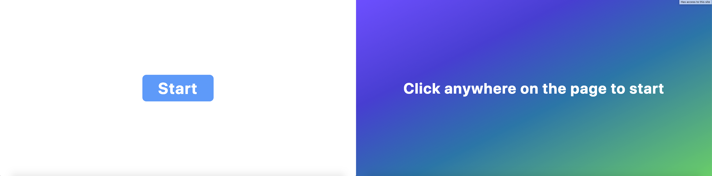
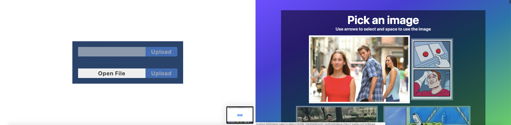
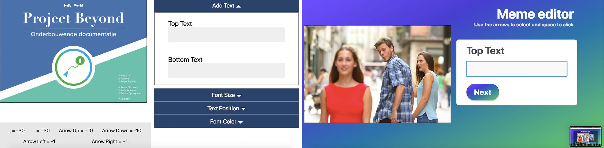

# Web Design - Jesse Dijkman
For this course we're going to design and make an accessible "component", like: a date-picker, color-picker, or any other component that is usually difficult for people with disabilities to use. The user I'm going to design for is: Marijn Meijles. Marijn is spastic and can't use the web like the most of us. So I'm going to make something that is accessible for him and other people.

---

## Table of Contents
- [Concept](#concept-)
- [User Scenario](#user-scenario-)
- [Test 1](#test-1-)
  - [Iteration 1](#iteration-1-)
- [Test 2](#test-2-)
  - [Iteration 2](#iteration-2-)
- [Things to Add](#things-to-add-)

---

## Concept 💡
My concept was a color-picker and it was the main-component of my new concept (thanks to [Koop](https://github.com/KoopReynders)), which is a meme-maker. I don't know if Marijn is into memes, I hope so. If he's not into memes it doesn't matter, because he's just a representation of our target-audience. But this seems like something that isn't accessible anywhere and can be made accessible. 

---

## User Scenario 🤷‍
### Version 1
Marijn is at home looking at memes, he'd like to make a meme himself. But he has to create it with a keyboard. He just needs to upload (or refer to) an image and use it as a template. He can type the text and adjust their positions. He could also add rectangles and circles, and move them using his keyboard to adjust his meme. After he's done he needs to be able to download the meme.

### Version 2
Marijn is at home with his laptop looking, at memes. He'd like to make a meme himself. He looks for a meme-maker that you can use with arrow keys and that has large buttons; so he can use his trackpad aswell. He'd like to have a catalog with meme-formats that he can pick from. Now he just needs to add text, alter their sizes and colors and maybe add some other images. After he's done he'd like to download it as a PNG or JPEG.

---

## Test 1
#### Date: 18-04-2019
Because the week prior, Marijn didn't make it, this was our first test. When he entered the room I was a bit surprised by how severe his disability was. When the tests started, you could already tell that he didn't use the web at the same speed as us, not even close actually. By observing I saw he had trouble with accuracy. And almost right from the start we found out that he doesn't use the tab key. He mainly uses the spacebar, sticky keys, arrow keys and also the trackpad to my surprise. This meant that a lot of the other student weren't able to test well; because the tab key on his laptop didn't work. Because he uses his trackpad, I asked if he'd rather have big buttons. He said yes, which actually was the main feedback.

### Insights
- **He does not use the tab key**
- **He does use the trackpad, spacebar and the arrow keys and sticky keys**
- **Buttons need to be big and close together**

These are the insight from just observing and asking questions. At the end of the session the school intercom announced that the building was going to close. And because I gained important insights by just being there, and my prototype was tab focussed, I didn't feel like I needed to test my prototype. 

### Iteration 1
After the test I knew I had to change a lot. The main things I needed to change in my prototype were:
- Make navigation possible through the use of the arrow keys and the spacebar
- Make the buttons large and closer together
- Seperate the meme-editor into easily digestible sections
- Change the styling (Not important)
- Scrap the ability to upload your own images (or maybe add this later)
- Have list with meme-formats to choose from

So this is what I did ... 25th of April, the day of test 2 😅.
I removed the image upload, and added an API which provides me with a lot of meme-formats [API link](https://api.imgflip.com/).
I implemented navigation with arrow keys and spacebar, seperated the editor into sections.

### Comparison
#### Page 1 (old-new)

#### Page 2 (old-new)

#### Page 3 (old-new)

---

## Test 2
#### Date: 25-04-2019
This week, one day before the deadline we had another test session with Marijn. I was the last one. I was worried as always that it wouldn't go well, but ... it wen't pretty great actually. When he started looking for meme-formats on page 2, I saw that the first element (which has an automatic focus) lost focus immediately; probably due to a misclick or wrong button press. So the arrow keys didn't realy work there like I intended but he could scroll with them. Then he wen't on to add the top text, which worked, it looked like he had a bit of trouble with the arrow keys, because I think focus was lost again (but I'm not sure). He went through these steps at a pretty decent pace. Moving the text worked, changing the size worked. The only feedback I got was from Vasilis.

### Insights
- **Better default (like automatic text size, black border around the text**
- **Maybe a skip button**

Better defaults refers to the fact that the text is white without a border, so when the background is white you can't see it. And the font is incorrect, it should be Immpact.

### Iteration 2
Because we only had one day, I didn't get to iterate (maybe I did, but then you wouldn't be able to read this message 😮)

---

## Things to Add
There are some things I'd like to add:
- A way to add more text, not just top and bottom
- Font-selection
- Ability to change colors (which was possible in my first app, which is located in this repo)
- A way to switch between editing sections using the number keys or arrows
- Easy skip-button

---

## Sources
- [API](https://api.imgflip.com/)
- Concept by [Koop Reynders](https://github.com/KoopReynders)), thanks

---

## License
MIT © [Jesse Dijkman](https://github.com/jesseDijkman1)
